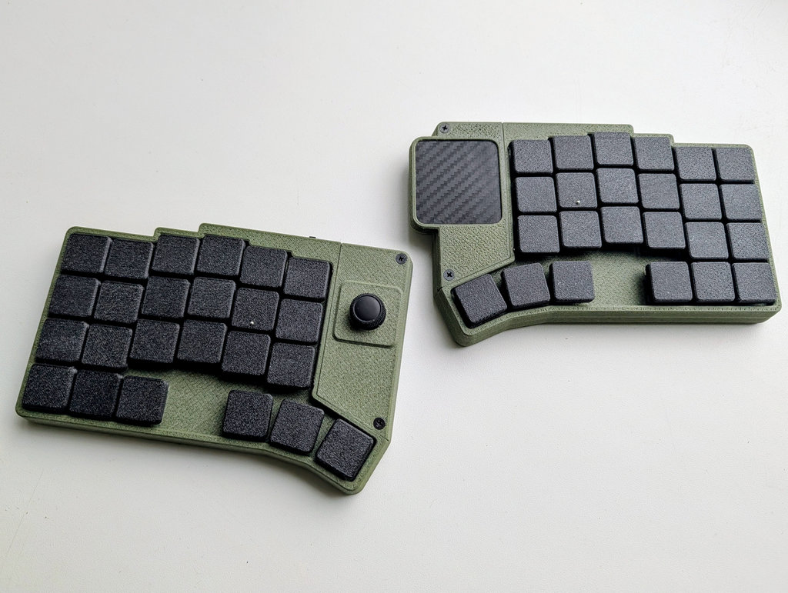

# zmk-cornedeon-2mod

ZMK-based handwired Modular Cornedeon keyboard

Keyboard Maintainer: [alko](https://github.com/alko-kbd/zmk-cornedeon-2mod) [alko-kbd@alk0.ru](mailto:alko-kbd@alk0.ru)

Web Site: [cornedeon.ru](https://cornedeon.ru)

## Local build

Prepare build environvent (devcontainer) as described in ZMK docs.

~# cd zmk-workspace/zmk

~zmk-workspace/zmk# git clone https://github.com/alko-kbd/zmk-cornedeon-2mod

~zmk-workspace/zmk# cd ..

~zmk-workspace$ devcontainer exec --workspace-folder ./zmk /bin/bash

#workspaces/zmk# ./zmk-cornedeon-2mod/build.sh <dongle|left|left_joy|right_tps43|right_tps43_central>
